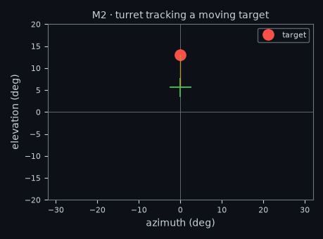
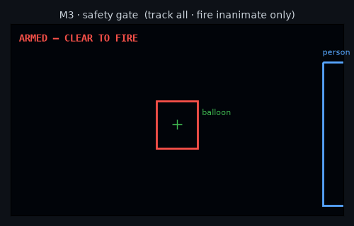
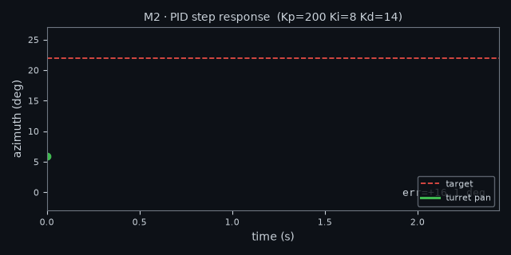
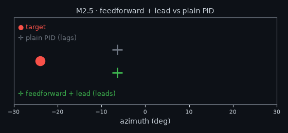
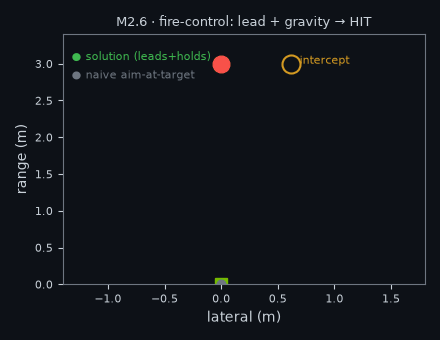
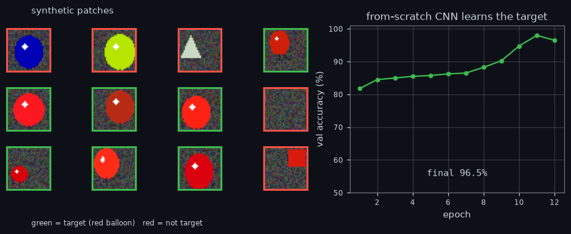
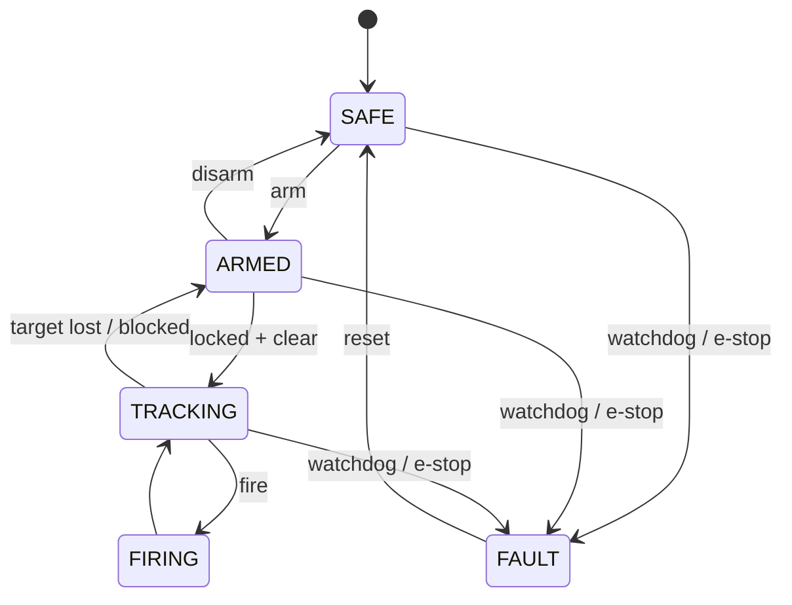

# 🛡️ AEGIS — CV-Targeting Turret

> *A computer-vision turret that tracks anything and fires only on inanimate targets — with the safety architecture as a first-class, testable feature, not an afterthought.*


AEGIS detects and tracks objects in real time (CNN), aims a pan/tilt gimbal with a tuned PID loop, and fires a Nerf flywheel gun at inanimate showcase targets **only under explicit human-in-the-loop arming and a safety gate enforced in code**. Built to run a custom-trained detector on a Jetson Orin Nano.

Three reasons it exists: **(a)** it's a genuinely fun build, **(b)** it's the cleanest way to learn the full perception → control → actuation pipeline end-to-end, **(c)** it's a portfolio piece that speaks the industry's language — custom-trained CNN, edge-GPU deployment, real-time control, safety engineering.

---

## See it move

| Control loop tracking a moving target | Safety gate: track all, fire inanimate only |
|:--:|:--:|
|  |  |
| The PID drives the aim crosshair (green) to chase the target (red). | Drag a *person* near the target and the gate flips **CLEAR → BLOCKED** live. |

| PID step response (tuned in simulation) | Feedforward + lead — aim *ahead* of the target |
|:--:|:--:|
|  |  |
| 22° step acquired in **0.67 s**, ~1% overshoot, 0.16° steady-state. | Plain PID trails the target; α-β velocity feedforward + lead puts the aim **in front** of it. |

| Ballistic fire-control — range → lead + gravity hold-over → **hit** |
|:--:|
|  |
| With stereo range + dart speed, the solver leads the moving target and aims above for gravity; the solution dart hits where naive aim-at-target misses. |

| A CNN built from scratch, learning the designated target |
|:--:|
|  |
| Our own conv net (hand-written, verified against PyTorch) trains on synthetic patches to tell the red balloon from wrong-colour balloons and distractors — 99% val accuracy. |

> **▶ Interactive demo** — tune the PID gains, drive the turret sim, and play with the safety gate live in your browser. The page runs the **actual** `controller.py` / `simulator.py` / `safety.py` via Pyodide — the same code that flies the turret. See [Running the demo](#-interactive-demo).

---

## How it works


Each frame: the detector finds objects → the tracker picks one and computes a normalised **aim error** → the PID turns that error into pan/tilt angles → the turret drives the servos and asks the **safety gate** whether it may fire. The architecture is deliberately split so the **perception, control and safety maths are headless and fully unit-tested**; the same `controller.py` runs unchanged in the simulator, the live pipeline, and (M3) on the Jetson.

**Predictive tracking (M2.5).** Pure feedback always trails a moving target — it needs a position error to generate the velocity to keep up. `tracking.py` removes that lag the way a gun director does: an **α-β filter** (`estimator.py`) smooths the target's position and velocity; the velocity is fed *forward* straight to the servos (the PID only trims the residual), and the aim is **led** ahead by the dart's flight-time so a moving target can actually be hit. In sim this cuts steady-state tracking lag by **~68%** (5.8° → 1.9° RMS), and on a constant-velocity target the aim leads by exactly `velocity × lead_time`.

**Stereo ranging + fire-control (M2.6).** A fixed lead time is a guess; the physical version computes it. `stereo.py` recovers **range** from a calibrated stereo pair (`Z = focal·baseline / disparity`, with range error growing as the *square* of distance). `ballistics.py` then solves the real fire-control problem: given range, dart muzzle speed and target velocity, find the launch direction and time-of-flight where dart and target **meet** — leading horizontally *and* aiming above to beat gravity drop (the classic implicit moving-interceptor problem, solved by iteration). A **drag model** (`DartModel`) captures the foam dart's deceleration (`v = v₀·e^(-k·s)`), which stretches the flight time and so *increases* both the lead and the hold-over. The whole chain is wired into the live loop by `FireControlTracker` — bearing + stereo range → 3D target state → firing solution → servo command — and validated by a hit/miss shot simulation: the turret aims so a dart *with gravity and drag* hits the moving target where naive aim-at-target misses by tens of centimetres.

**Sharper fire-control (M2.7).** Three refinements addressing real limits: **latency compensation** predicts the target through the perception+actuation delay before launch (so the lead covers system latency, not just dart flight — a 100 ms pipeline adds ~3.5° of lead at 5 m); a **constant-acceleration α-β-γ filter** (`estimator.py`) follows a *maneuvering* target the constant-velocity model can't; and a **numerical solver** (`refine=`) flies the shot and nulls the closest-approach miss, closing the heavy-drag gap the closed-form seed leaves (k=0.15 at 5 m: a 16 cm miss → a 1 cm hit).

**Multi-target tracking (MOT).** `mot.py` turns per-frame detections into persistent tracks with stable IDs via predict → IoU-match → update → age-out. Tracks confirm only after several hits (rejects one-frame false positives) and **coast on their velocity estimate through brief occlusion**, so a momentary miss keeps the lock and the ID instead of dropping or re-numbering it. `prioritize()` picks which confirmed track to engage — the foundation for tracking a crowd and choosing one.

**A CNN from scratch (M5).** The detector is already a CNN (YOLOv11), but it's a black box we fine-tune. `aegis/cnn/` adds a conv net we **build ourselves** — our own architecture (two conv blocks + two FC layers) — as a learned **target discriminator**: even when YOLO says "balloon", this confirms it's the *designated* (red) one before it's fireable. "From scratch" is literal here: the conv/pool/linear **forward** ops are pure NumPy (`cnn/conv.py`, matching PyTorch to ~1e-7), *and* the **backward** pass + an Adam optimiser are hand-written too (`cnn/autograd.py`), gradient-checked against finite differences — so the net is trained with **zero autograd** (`train_scratch.py` → 99.7% val accuracy in ~5 s of pure NumPy). Nothing about this CNN is a black box.

## Built from first principles

A deliberate theme: the algorithms are **hand-written and tested**, not imported. Only the heavy lifting (YOLO inference, training autograd for the *fine-tuned* detector) leans on libraries.

| Component | From scratch |
|---|---|
| **PID control** + tuned gains | `controller.py` |
| **α-β / α-β-γ filters** (velocity / acceleration) | `estimator.py` |
| **Kalman filter** (covariance, optimal gain) | `kalman.py` |
| **Ballistic intercept solver** (gravity, drag, latency, numerical refine) | `ballistics.py` |
| **Stereo geometry** (range from disparity) | `stereo.py` |
| **SORT multi-target tracking** (IoU matching, lifecycle) | `mot.py` |
| **Non-max suppression** (greedy + soft-NMS, matches torchvision) | `nms.py` |
| **Safety state machine** + failsafes | `safety_fsm.py` |
| **CNN forward** (conv / pool / linear in NumPy) | `cnn/conv.py` |
| **CNN backprop + Adam** (trained with zero autograd) | `cnn/autograd.py` |

Every one is covered by unit tests — including a finite-difference **gradient check** on the backprop and a **NumPy-vs-PyTorch** equivalence check on the forward pass.

## Safety model — *enforced in code, not just documented*

Firing is gated by [`safety.py`](src/aegis/safety.py). It is defence-in-depth, so no single misconfiguration can authorise a shot at a living thing:


People and animals are on a **hard denylist that overrides everything** — they can never be a target even if mistakenly added to the allowlist. Firing additionally requires a physical arm switch **and** an explicit fire action. *Track all, fire inanimate only* is a property of the code, demonstrated by 9 dedicated tests and the safety-gate demo above.

Wrapping the gate, `safety_fsm.py` adds a formal **state machine** and the operational failsafes a real weapon system needs: a **perception watchdog** (stale vision trips FAULT), **temporal confirmation** (N consecutive CLEAR frames before a shot, killing single-frame false positives), **angular no-fire zones**, a **rate limit** and a **magazine count** — with an audit log of every transition and shot.



## Milestones

| # | Milestone | State |
|---|-----------|-------|
| **M1** | Perception + targeting loop (YOLOv11 → aim error) | ✅ done |
| **M2** | PID pan/tilt control, tuned in closed-loop simulation | ✅ done (sim) |
| **M2.5** | Predictive tracking — α-β velocity feedforward + target lead | ✅ done (sim) |
| **M2.6** | Stereo ranging + ballistic fire-control (intercept + gravity + drag, wired into tracking) | ✅ done (sim) |
| **M2.7** | Sharper fire-control — latency comp, α-β-γ accel Kalman, numerical solver | ✅ done (sim) |
| **MOT** | SORT multi-target tracking — stable IDs, occlusion survival, prioritisation | ✅ done |
| **M3** | Actuation layer + safety gate (mock-tested; real drivers stubbed) | ✅ software done · ⏳ hardware |
| **M3.1** | Safety state machine + failsafes (watchdog, temporal confirmation, no-fire zones, rate/magazine) | ✅ done |
| **M4** | Custom detector: dataset → train → ONNX/TensorRT export | ✅ pipeline done · ⏳ real data |
| **M5** | From-scratch CNN target discriminator (own conv net, NumPy-verified) | ✅ done |

Remaining work is real-world, not code: order the kit ([docs/HARDWARE.md](docs/HARDWARE.md)), capture+label a real dataset, build the TensorRT engine on the Jetson.

---

## Quickstart

```bash
python3.13 -m venv .venv && source .venv/bin/activate
pip install -r requirements.txt           # YOLOv11 + torch + opencv

python main.py                            # M1+M2: live tracking + commanded servo angles
python main.py --classes "sports ball" --turret mock   # M3: full safety + fire loop, no hardware
python sim.py --plot                      # M2: tune the PID, save response plots
python train.py --synthetic 16 --epochs 1 --device cpu # M4: smoke-test the training pipeline
python train_cnn.py                       # M5: train the from-scratch CNN (PyTorch)
python train_scratch.py                   # M5: train it with ZERO autograd (pure-NumPy backprop)
pytest                                     # 139 headless tests (torch-gated ones skip without torch)
```
In the live window: `a` arm/disarm · `f` fire (only if the gate says CLEAR) · `q` quit.

## ▶ Interactive demo

Static pages that run the real control / safety / ballistics code in-browser via Pyodide. Built to run locally:
```bash
cd docs/site && python -m http.server 8000   # then open http://localhost:8000
```
Three demos, linked by an **evolution** nav so you can see the project grow:
- **① Control & Safety** (`index.html`) — a **PID tuner** (live response + animated turret viz, with a feedforward toggle and lead-time slider) and the **safety-gate playground** (drag a person near the target → the gate flips CLEAR/BLOCKED live).
- **② Stereo Fire-Control** (`firecontrol.html`) — **stereo ranging** (disparity → depth, with its quadratic error growth) and the **ballistic solver** (top-down lead + side-on gravity arc; muzzle-velocity, range, target-speed and **dart-drag** sliders; the solution dart hits, naive misses).
- **③ Vision / CNN** (`cnn.html`) — runs our **from-scratch NumPy CNN** in-browser: a **convolution playground** (pick a kernel, see the feature map) and the **live classifier** (draw a balloon, watch the conv-1 feature maps and the TARGET/not verdict — a red *square* scores 0, so it really learned colour *and* shape).

(To publish as live URLs, make the repo public and enable GitHub Pages on `docs/site`.)

## Repo layout

```
aegis/
├── main.py                  # CLI: live tracking (M1) + controller (M2) + turret (M3)
├── sim.py                   # CLI: M2 control simulator & PID tuner
├── capture.py train.py export.py   # M4: dataset capture, training, edge export
├── train_cnn.py             # M5: train the from-scratch CNN discriminator
├── docs/
│   ├── media/               # README GIFs (generated by tools/make_gifs.py)
│   ├── site/                # interactive Pyodide demo
│   ├── HARDWARE.md          # M3 bill of materials + wiring + bring-up
│   └── M4-TRAINING.md       # dataset -> train -> deploy workflow
├── src/aegis/
│   ├── tracker.py           # target select + aim-error maths (pure — tested)
│   ├── controller.py        # PID + PanTiltController + tuned factory (pure — tested)
│   ├── estimator.py         # α-β velocity + α-β-γ accel filters (pure — tested)
│   ├── tracking.py          # feedforward+lead + FireControlTracker (pure — tested)
│   ├── stereo.py            # stereo range from disparity (pure — tested)
│   ├── ballistics.py        # intercept + gravity + drag + latency + numerical solver (pure — tested)
│   ├── mot.py               # SORT multi-target tracking: IDs, occlusion, prioritise (pure — tested)
│   ├── nms.py               # non-max suppression: greedy + soft-NMS (pure — tested vs torchvision)
│   ├── cnn/                 # M5 from-scratch CNN: conv ops + backprop (autograd.py), model, discriminator
│   ├── kalman.py            # from-scratch Kalman filter (pure NumPy — tested)
│   ├── simulator.py         # closed-loop camera/target model + tracking metrics
│   ├── safety.py            # SafetyGate fire-authorisation logic (pure — tested)
│   ├── safety_fsm.py        # safety state machine + failsafes (pure — tested)
│   ├── turret.py            # M3 integration: controller + servos + trigger + gate
│   ├── config.py detector.py overlay.py pipeline.py   # config, YOLO adapter, HUD, loop
│   ├── hardware/            # driver ABCs + servo mapping, mocks, PCA9685/Nerf (lazy)
│   └── data/                # M4: YOLO label/split/data.yaml (pure), builder, synth
└── tests/                   # tracker, controller, safety, hardware, dataset — 139 tests
```

## Design notes

- **Jetson over Pi 5 + Coral** — Coral runs only int8 TFLite (a quantise→Edge-TPU-compile tax on every custom model); the Jetson runs torch/YOLO natively and is reusable across a robotics fleet. See [docs/HARDWARE.md](docs/HARDWARE.md).
- **The plant is an integrator** (velocity→angle), so P alone gives zero steady-state error to a step — Ki is kept small (it *hurts* moving-target tracking), Kd damps the acquisition overshoot. Tuned in-sim: `Kp=200, Ki=8, Kd=14`.
- **Feedback can't lead — feedforward can.** A PID only reacts to current error, so it structurally lags a moving target. An α-β filter estimates target velocity; feeding it forward cancels the lag, and projecting it forward by the dart's flight-time gives the lead needed to hit a moving target. The α gain trades responsiveness against noise tolerance on real detections.
- **Testable-core discipline** — every bug-prone bit (aim-error sign conventions, PID anti-windup, the safety policy, YOLO label conversion) is pure Python with no torch/cv2, so 51 tests run in milliseconds with no GPU.

> *Built for fun, learning, and portfolio depth. Any quotes used in project docs must be real, sourced attributions — no invented quotes.*
