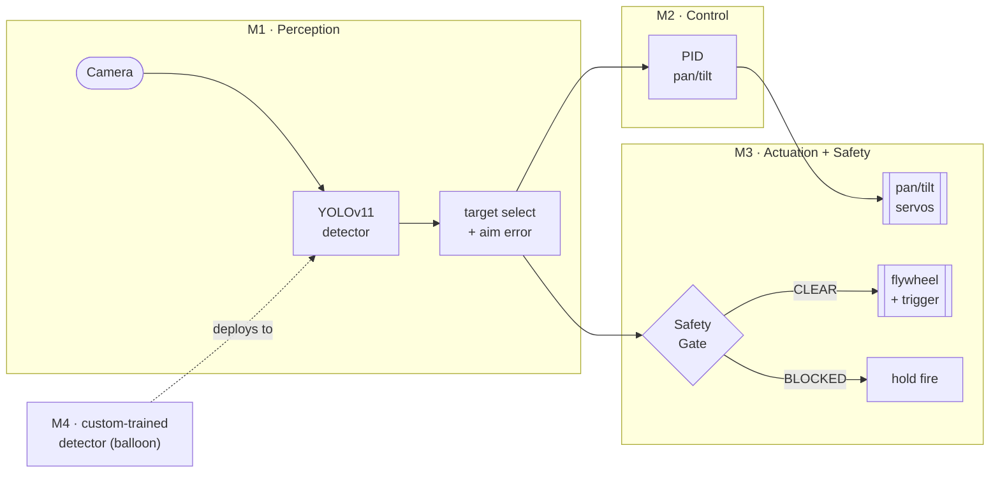
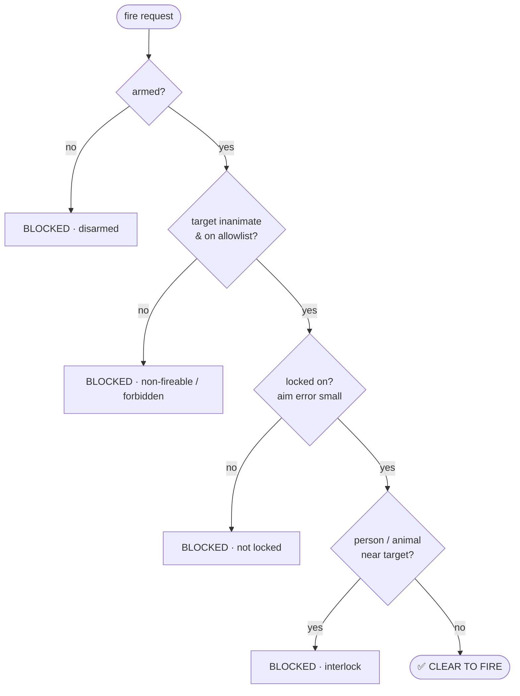

# 🛡️ AEGIS — CV-Targeting Turret

> *A computer-vision turret that tracks anything and fires only on inanimate targets — with the safety architecture as a first-class, testable feature, not an afterthought.*


AEGIS detects and tracks objects in real time (CNN), aims a pan/tilt gimbal with a tuned PID loop, and fires a Nerf flywheel gun at inanimate showcase targets **only under explicit human-in-the-loop arming and a safety gate enforced in code**. Built to run a custom-trained detector on a Jetson Orin Nano.

Three reasons it exists: **(a)** it's a genuinely fun build, **(b)** it's the cleanest way to learn the full perception → control → actuation pipeline end-to-end, **(c)** it's a portfolio piece that speaks the industry's language — custom-trained CNN, edge-GPU deployment, real-time control, safety engineering.

---

## See it move

| Control loop tracking a moving target | Safety gate: track all, fire inanimate only |
|:--:|:--:|
|  |  |
| The PID drives the aim crosshair (green) to chase the target (red). | Drag a *person* near the target and the gate flips **CLEAR → BLOCKED** live. |

| PID step response (tuned in simulation) | Feedforward + lead — aim *ahead* of the target |
|:--:|:--:|
|  |  |
| 22° step acquired in **0.67 s**, ~1% overshoot, 0.16° steady-state. | Plain PID trails the target; α-β velocity feedforward + lead puts the aim **in front** of it. |

| Ballistic fire-control — range → lead + gravity hold-over → **hit** |
|:--:|
|  |
| With stereo range + dart speed, the solver leads the moving target and aims above for gravity; the solution dart hits where naive aim-at-target misses. |

> **▶ Interactive demo** — tune the PID gains, drive the turret sim, and play with the safety gate live in your browser. The page runs the **actual** `controller.py` / `simulator.py` / `safety.py` via Pyodide — the same code that flies the turret. See [Running the demo](#-interactive-demo).

---

## How it works



Each frame: the detector finds objects → the tracker picks one and computes a normalised **aim error** → the PID turns that error into pan/tilt angles → the turret drives the servos and asks the **safety gate** whether it may fire. The architecture is deliberately split so the **perception, control and safety maths are headless and fully unit-tested**; the same `controller.py` runs unchanged in the simulator, the live pipeline, and (M3) on the Jetson.

**Predictive tracking (M2.5).** Pure feedback always trails a moving target — it needs a position error to generate the velocity to keep up. `tracking.py` removes that lag the way a gun director does: an **α-β filter** (`estimator.py`) smooths the target's position and velocity; the velocity is fed *forward* straight to the servos (the PID only trims the residual), and the aim is **led** ahead by the dart's flight-time so a moving target can actually be hit. In sim this cuts steady-state tracking lag by **~68%** (5.8° → 1.9° RMS), and on a constant-velocity target the aim leads by exactly `velocity × lead_time`.

**Stereo ranging + fire-control (M2.6).** A fixed lead time is a guess; the physical version computes it. `stereo.py` recovers **range** from a calibrated stereo pair (`Z = focal·baseline / disparity`, with range error growing as the *square* of distance). `ballistics.py` then solves the real fire-control problem: given range, dart muzzle speed and target velocity, find the launch direction and time-of-flight where dart and target **meet** — leading horizontally *and* aiming above to beat gravity drop (the classic implicit moving-interceptor problem, solved by iteration). It's validated by a hit/miss shot simulation: the solution connects where naive aim-at-target misses by tens of centimetres.

## Safety model — *enforced in code, not just documented*

Firing is gated by [`safety.py`](src/aegis/safety.py). It is defence-in-depth, so no single misconfiguration can authorise a shot at a living thing:



People and animals are on a **hard denylist that overrides everything** — they can never be a target even if mistakenly added to the allowlist. Firing additionally requires a physical arm switch **and** an explicit fire action. *Track all, fire inanimate only* is a property of the code, demonstrated by 9 dedicated tests and the safety-gate demo above.

## Milestones

| # | Milestone | State |
|---|-----------|-------|
| **M1** | Perception + targeting loop (YOLOv11 → aim error) | ✅ done |
| **M2** | PID pan/tilt control, tuned in closed-loop simulation | ✅ done (sim) |
| **M2.5** | Predictive tracking — α-β velocity feedforward + target lead | ✅ done (sim) |
| **M2.6** | Stereo ranging + ballistic fire-control (intercept + gravity) | ✅ done (sim) |
| **M3** | Actuation layer + safety gate (mock-tested; real drivers stubbed) | ✅ software done · ⏳ hardware |
| **M4** | Custom detector: dataset → train → ONNX/TensorRT export | ✅ pipeline done · ⏳ real data |

Remaining work is real-world, not code: order the kit ([docs/HARDWARE.md](docs/HARDWARE.md)), capture+label a real dataset, build the TensorRT engine on the Jetson.

---

## Quickstart

```bash
python3.13 -m venv .venv && source .venv/bin/activate
pip install -r requirements.txt           # YOLOv11 + torch + opencv

python main.py                            # M1+M2: live tracking + commanded servo angles
python main.py --classes "sports ball" --turret mock   # M3: full safety + fire loop, no hardware
python sim.py --plot                      # M2: tune the PID, save response plots
python train.py --synthetic 16 --epochs 1 --device cpu # M4: smoke-test the training pipeline
pytest                                     # 72 headless tests, no GPU needed
```
In the live window: `a` arm/disarm · `f` fire (only if the gate says CLEAR) · `q` quit.

## ▶ Interactive demo

Static pages that run the real control / safety / ballistics code in-browser via Pyodide. Built to run locally:
```bash
cd docs/site && python -m http.server 8000   # then open http://localhost:8000
```
Two demos, linked by an **evolution** nav so you can see the project grow:
- **① Control & Safety** (`index.html`) — a **PID tuner** (live response + animated turret viz, with a feedforward toggle and lead-time slider) and the **safety-gate playground** (drag a person near the target → the gate flips CLEAR/BLOCKED live).
- **② Stereo Fire-Control** (`firecontrol.html`) — **stereo ranging** (disparity → depth, with its quadratic error growth) and the **ballistic solver** (top-down lead + side-on gravity arc; the solution dart hits, naive misses).

(To publish as live URLs, make the repo public and enable GitHub Pages on `docs/site`.)

## Repo layout

```
aegis/
├── main.py                  # CLI: live tracking (M1) + controller (M2) + turret (M3)
├── sim.py                   # CLI: M2 control simulator & PID tuner
├── capture.py train.py export.py   # M4: dataset capture, training, edge export
├── docs/
│   ├── media/               # README GIFs (generated by tools/make_gifs.py)
│   ├── site/                # interactive Pyodide demo
│   ├── HARDWARE.md          # M3 bill of materials + wiring + bring-up
│   └── M4-TRAINING.md       # dataset -> train -> deploy workflow
├── src/aegis/
│   ├── tracker.py           # target select + aim-error maths (pure — tested)
│   ├── controller.py        # PID + PanTiltController + tuned factory (pure — tested)
│   ├── estimator.py         # α-β velocity filter (pure — tested)
│   ├── tracking.py          # M2.5 feedforward + lead orchestrator (pure — tested)
│   ├── stereo.py            # M2.6 stereo range from disparity (pure — tested)
│   ├── ballistics.py        # M2.6 intercept + gravity fire-control solver (pure — tested)
│   ├── simulator.py         # closed-loop camera/target model + tracking metrics
│   ├── safety.py            # SafetyGate fire-authorisation logic (pure — tested)
│   ├── turret.py            # M3 integration: controller + servos + trigger + gate
│   ├── config.py detector.py overlay.py pipeline.py   # config, YOLO adapter, HUD, loop
│   ├── hardware/            # driver ABCs + servo mapping, mocks, PCA9685/Nerf (lazy)
│   └── data/                # M4: YOLO label/split/data.yaml (pure), builder, synth
└── tests/                   # tracker, controller, safety, hardware, dataset — 72 pure tests
```

## Design notes

- **Jetson over Pi 5 + Coral** — Coral runs only int8 TFLite (a quantise→Edge-TPU-compile tax on every custom model); the Jetson runs torch/YOLO natively and is reusable across a robotics fleet. See [docs/HARDWARE.md](docs/HARDWARE.md).
- **The plant is an integrator** (velocity→angle), so P alone gives zero steady-state error to a step — Ki is kept small (it *hurts* moving-target tracking), Kd damps the acquisition overshoot. Tuned in-sim: `Kp=200, Ki=8, Kd=14`.
- **Feedback can't lead — feedforward can.** A PID only reacts to current error, so it structurally lags a moving target. An α-β filter estimates target velocity; feeding it forward cancels the lag, and projecting it forward by the dart's flight-time gives the lead needed to hit a moving target. The α gain trades responsiveness against noise tolerance on real detections.
- **Testable-core discipline** — every bug-prone bit (aim-error sign conventions, PID anti-windup, the safety policy, YOLO label conversion) is pure Python with no torch/cv2, so 51 tests run in milliseconds with no GPU.

> *Built for fun, learning, and portfolio depth. Any quotes used in project docs must be real, sourced attributions — no invented quotes.*
